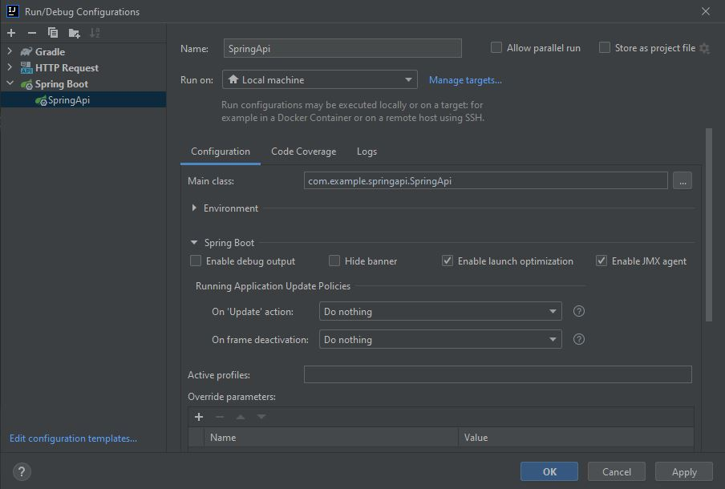
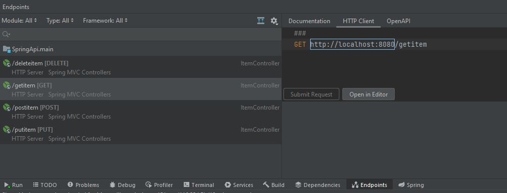

# Spring API
by Denny Imanuel

This project shows how to build Java Spring Boot API

### Requirement

1. IntelliJ IDE - you need to install IntelliJ on your Windows machine
3. Open JDK - you need to install Open JDK and set JAVA_HOME env
4. Gradle - you need to install Gradle and set Gradle_HOME env

### Run Configuration

On IntelliJ Run Configuration choose SpringBoot configuration and set as follows:

### Api Endpoint

Once you run the SpringApi configuration the endpoints will shows up as below:

